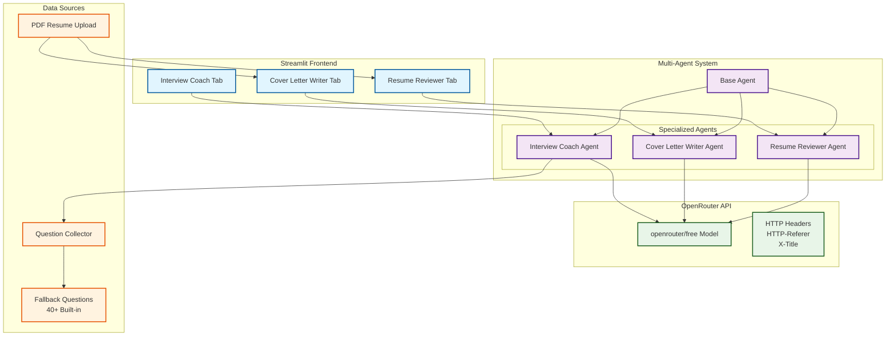
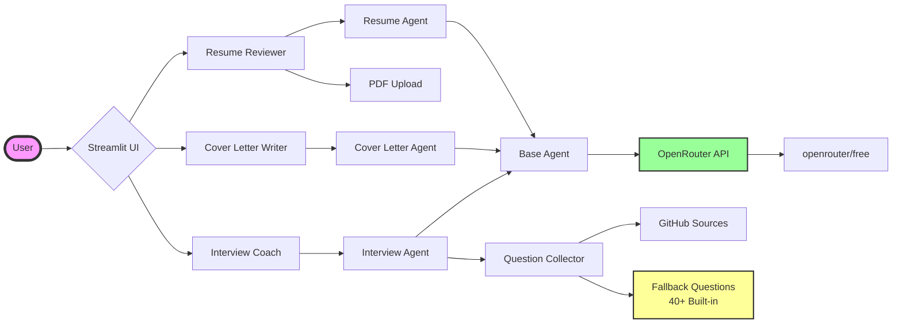
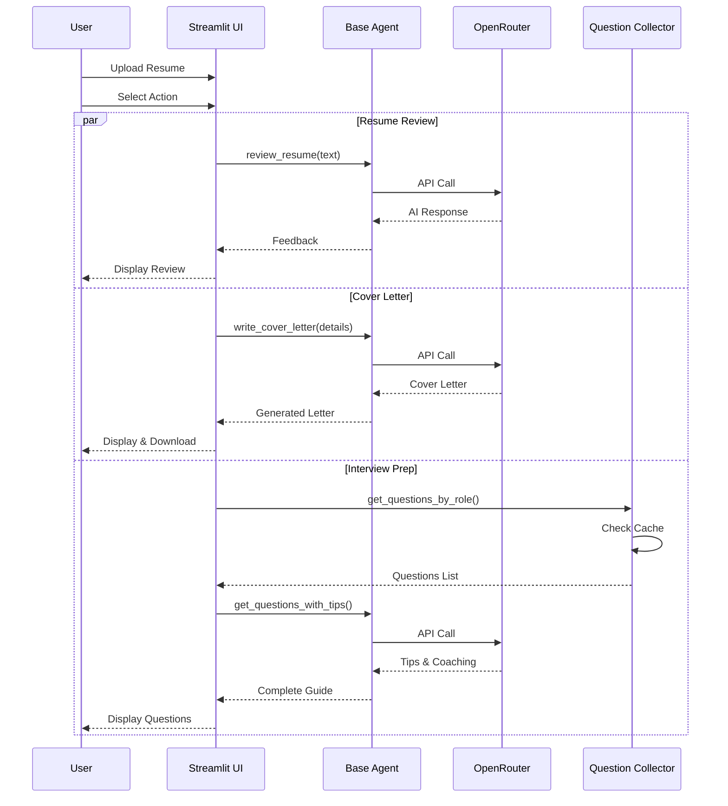
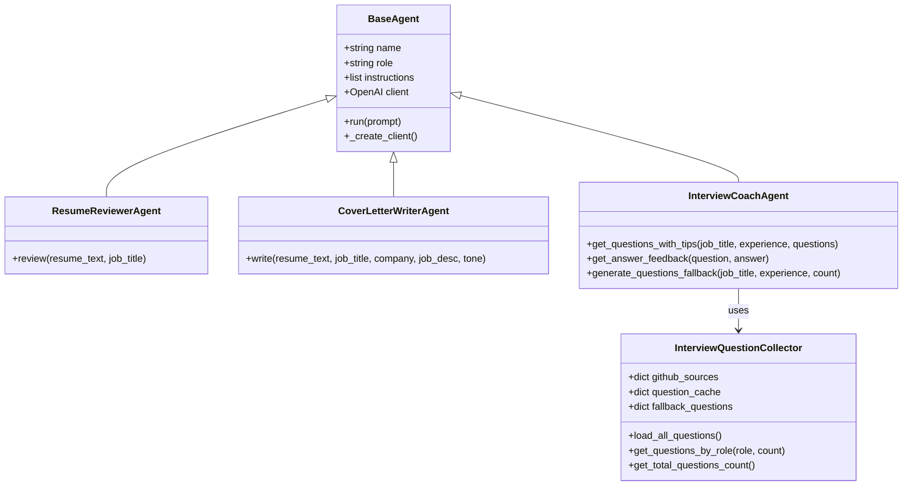

# 📄 AI-POWERED RESUME & JOB ASSISTANT

[](https://www.python.org/)
[](https://streamlit.io/)
[](https://openrouter.ai/)
[](LICENSE)

A powerful multi-agent AI system to help job seekers with resume optimization, cover letter generation, and interview preparation. Built with Python and Streamlit, powered by OpenRouter's free AI models.

<div align="center">
  
  
  
</div>

## 📋 Table of Contents
- [Features](#-features)
- [Architecture](#-architecture)
- [Installation](#-installation)
- [Usage](#-usage)
- [Project Structure](#-project-structure)
- [Configuration](#-configuration)
- [Troubleshooting](#-troubleshooting)
- [Contributing](#-contributing)
- [License](#-license)
- [Acknowledgements](#-acknowledgements)

## ✨ Features

### 🤖 Agent 1: Resume Reviewer
| Feature | Description |
|---------|-------------|
| 📄 **PDF Upload** | Upload your resume in PDF format |
| ✏️ **Manual Entry** | Paste resume text directly |
| 📊 **ATS Analysis** | Get Applicant Tracking System feedback |
| 💪 **Strengths** | Identify what's working well |
| 🔧 **Improvements** | Actionable suggestions to enhance your resume |
| 🔑 **Keywords** | Get recommendations for ATS-friendly keywords |

### ✍️ Agent 2: Cover Letter Writer
| Feature | Description |
|---------|-------------|
| 🎯 **Job Targeting** | Customize for specific job titles |
| 🏢 **Company Specific** | Tailor to company culture |
| 🎭 **Tone Options** | Professional, Enthusiastic, or Creative |
| 📝 **Job Description** | Paste JD for better matching |
| 💾 **Download** | Save your cover letter as text file |

### 🎤 Agent 3: Interview Coach
| Feature | Description |
|---------|-------------|
| 📚 **40+ Questions** | Built-in interview question database |
| 🎯 **Role Specific** | Questions for Frontend, Backend, Python, etc. |
| 📊 **Difficulty Levels** | Easy, Medium, Hard questions |
| 💡 **STAR Method** | Behavioral question guidance |
| ✅ **Answer Feedback** | Get feedback on your practice answers |

## 🏗 Architecture


### Component Flow Diagram


### 🔄 Data Flow Diagram

### 🧩 Class Diagram

## 📦 Installation

### Prerequisites
- Python 3.8 or higher
- OpenRouter API key (free)
- Git (optional)

### Step-by-Step Setup

#### 1. Clone the Repository
```bash
git clone https://github.com/Navneetsingh9/AICTE-BATCH7-AI-POWERED-RESUME-JOB-ASSISTANT.git
cd AICTE-BATCH7-AI-POWERED-RESUME-JOB-ASSISTANT
```
#### 2. Create Virtual Environment
```bash
-Windows
python -m venv venv
venv\Scripts\activate

-Mac/Linux
python3 -m venv venv
source venv/bin/activate
```

#### 3. Install Dependencies
```bash
pip install -r requirements.txt
```

#### 4. Set Up Environment Variables
```bash
Create a .env file in the root directory:
OPENROUTER_API_KEY=your_api_key_here
```

## 📁 Project Structure
```text
resume-job-assistant/
│
├── 📄 app.py                      # Main application
├── 📄 config.py                   # Configuration settings
├── 📄 requirements.txt            # Dependencies
├── 📄 .env                        # Environment variables
├── 📄 .gitignore                  # Git ignore file
├── 📄 README.md                   # This file
│
├── 📁 agents/                      # AI Agents
│   ├── 📄 __init__.py
│   ├── 📄 base_agent.py           # Base agent class
│   ├── 📄 resume_reviewer.py       # Agent 1
│   ├── 📄 cover_letter_writer.py   # Agent 2
│   └── 📄 interview_coach.py       # Agent 3
│
├── 📁 utils/                        # Utilities
│   ├── 📄 __init__.py
│   ├── 📄 pdf_extractor.py         # PDF processing
│   └── 📄 question_collector.py    # Interview questions
│
└── 📁 ui/                           # UI Components
    ├── 📄 __init__.py
    ├── 📄 styles.py                 # Custom CSS
    ├── 📄 sidebar.py                # Sidebar UI
    └── 📁 tabs/                      # Tab components
        ├── 📄 __init__.py
        ├── 📄 resume_tab.py          # Tab 1 UI
        ├── 📄 cover_letter_tab.py    # Tab 2 UI
        └── 📄 interview_tab.py       # Tab 3 UI
```

Run this test to ensure everything works:
```bash
python -c "from utils.question_collector import InterviewQuestionCollector; q = InterviewQuestionCollector(); print(f'✅ Questions loaded: {q.get_total_questions_count()}')"
```
MIT License

Copyright (c) 2026 Navneet Singh

Permission is hereby granted, free of charge, to any person obtaining a copy
of this software and associated documentation files...

<div align="center"> <h3>Made with ❤️ for job seekers everywhere</h3> <p>Happy Job Hunting! 🎉</p> </div> 
